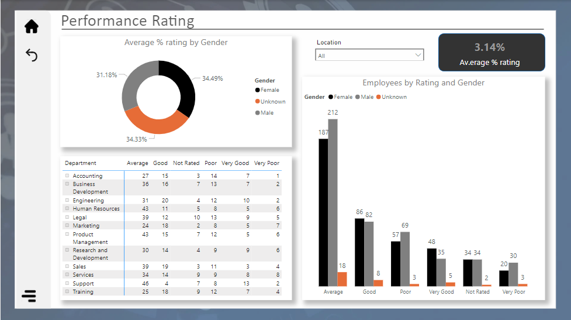

# Gender Analysis for Palmoria Group

## Project Overview

The Palmoria Group, a prominent manufacturing company headquartered in Nigeria, is currently grappling with critical issues surrounding gender inequality across its three regional divisions. Recently, the company has come under scrutiny in the media, with a notable headline branding it a "Manufacturing Patriarchy." This negative portrayal poses a significant threat to Palmoria's strategic goals of regional and international expansion. Key concerns, such as gender pay disparities and broader systemic inequalities, have emerged as potential challenges that, if left unresolved, may escalate further. This analysis seeks to provide a comprehensive assessment of the Palmoria Group's stance on gender inequality, offering insights to guide necessary interventions and ensure alignment with best practices for equity and inclusion.
## Problem Statement
The case questions to be addresed are:
1.  What is the gender distribution in the organization? Distil to regions and departments
2.  Show insights on ratings based on gender
3.  Analyse the company’s salary structure. Identify if there is a gender pay gap. If there is, identify the department and regions that should be the focus of management
4.  A recent regulation was adopted which requires manufacturing companies to pay employees a minimum of 
    ₦100,000-Does Palmoria meet this requirement?-Show pay distribution of employees grouped by a band of 
    ₦10,000. For example: How many employees fall into a band 
    of ₦10,000 – ₦20,000, ₦20,000 – ₦30,000 etc. Also visualize this by regions
## Extraction, Transformation and Loading of Data
The datasets were extracted from an Excel file, and the following transformations were performed using the Power Query Editor:

-  `Data Filtering`: Employees without a specified salary and department were removed from the dataset to ensure completeness and accuracy.
-  `Gender Assignment`: For employees whose gender status was not declared, the generic gender status "Unknown" was assigned. This step was implemented to maintain consistency across the dataset.
-  `Indexing`: A column index was created to serve as the employee ID. This index was generated after sorting the employee dataset in alphabetical order by employee name, ensuring a systematic assignment of IDs.
-  `Unique Identifier Creation`: To uniquely identify each employee, the employee ID and employee name were concatenated. This combination provided a distinct identifier for every employee in the dataset.

## Skills/concepts demonstrated:
The following Power Bi features were incorporated
-  Bookmarkig and Filtering
-  DAX and Quick measures
-  Page Navigation
-  Modelling

## The Logic
-  A dynamic Salary Range table (using DAX shown below) was created to define salary ranges effectively.
  ~~~ DAX
SalaryRanges = 
DATATABLE(
    "Salary Range", STRING,
    "MinSalary", INTEGER,
    "MaxSalary", INTEGER,
    "SortOrder", INTEGER,
    {
        {"10,000 to 19,999", 10000, 19999, 1},
        {"20,000 to 29,999", 20000, 29999, 2},
        {"30,000 to 39,999", 30000, 39999, 3},
        {"40,000 to 49,999", 40000, 49999, 4},
        {"50,000 to 59,999", 50000, 59999, 5},
        {"60,000 to 69,999", 60000, 69999, 6},
        {"70,000 to 79,999", 70000, 79999, 7},
        {"80,000 to 89,999", 80000, 89999, 8},
        {"90,000 to 99,999", 90000, 99999, 9},
        {"100,000 to 109,999", 100000, 109999, 10},
        {"110,000 to 119,999", 110000, 119999, 11}
    }
)
~~~
The rating in the dimension table (Bonus) is mapped to the fact table (employee dataset) using Data Analysis Expressions(DAX) below
 ~~~ DAX
RatingPercentage = 
VAR RatingColumn = 'Employee Dataset'[Rating]
VAR DepartmentColumn = 'Employee Dataset'[Department]

RETURN 
SWITCH(
    TRUE(),
    RatingColumn = "Very Poor", RELATED('Bonus'[Very Poor]),
    RatingColumn = "Poor", RELATED('Bonus'[Poor]),
    RatingColumn = "Average", RELATED('Bonus'[Average]),
    RatingColumn = "Good", RELATED('Bonus'[Good]),
    RatingColumn = "Very Good", RELATED('Bonus'[Very Good]),
    0  // Default value if no match
)
~~~
Employees' salaries were dynamically assigned to the appropriate salary ranges, ensuring accurate classification and analysis. 
-  Several measures were implemented to facilitate effective visualization and reporting of the datasets.
## Modelling
A star schema was adopted in the modelling. The dimension tables are joined to the fact table on one-to-many relationship

## Visualization
The report comprises of eight(8) pages:
- Landing page
- Overview
- Gender distribution
- Salary structure
- Performance rating
- Salary and Bonus
- Bonus performance
- Salary structure to compliance

### Landing page
This is the Landing/Home page  where one can navigate to other pages:

### Overview 
The Overview page shows the summary of the insight obtained from the analysis of the data:

Overview                  |  Overview with menu
:-------------------------|-----------------------------------------------------------------
 | 
#### `Findings`
- The analysis reveals significant disparities in both employee count and salary distribution across genders within the Palmoria Group. Males dominate the workforce with a total of 462 employees, representing a substantial 1,084.62% increase compared to the "Unknown" gender category, which has the lowest count at just 39 employees.

- In terms of salary distribution, males also receive the highest portion of total salaries, accounting for 50.29%. This is followed closely by females, who receive 48.28% of the total compensation. However, individuals classified under "Unknown" gender are disproportionately affected, receiving only 4.43% of the total salary distribution.

### Gender distribution
The page distribution shows the analysis of the gender distribution across different regions and departments

#### `Findings`
- The analysis of the Palmoria Group's workforce across its three regions reveals significant regional and gender-based disparities, particularly in the Kaduna region. Kaduna stands out as the region with the highest number of employees overall. Notably, male employees in Kaduna account for 19.29% of the total workforce, reflecting a pronounced gender imbalance.

- Kaduna also exhibits the widest gender distribution gap between male and female employees, with males having the highest average employee count at 154, followed by females at 144, and those categorized as "Unknown" significantly lower at 13.

- In the Legal department, the gender imbalance persists, with male employees making up 5.25% of the workforce. This department also reports the highest disparity between male and female employees, further underscoring the need for targeted interventions to address these imbalances.

These findings highlight critical gender disparities across the company's operations, particularly in the Kaduna region and the Legal department, where male dominance in workforce representation is most pronounced. Addressing these gaps will be essential for fostering a more inclusive and equitable work environment

### Salary structure
This page shows the analysis of salary structure amongst the genders across different regions and departments

#### `Findings`
- The salary analysis reveals significant disparities in compensation across genders within the Palmoria Group. Males hold the highest total salary, amounting to ₦34,621,050, followed by females at ₦31,172,540, and those classified as "Unknown" with a considerably lower total of ₦3,050,020.
- In the Kaduna region, males account for 19.60% of the total salary distribution, reinforcing the gender-based salary gap in this region. On average, males also receive the highest salary, with an average total of ₦11,540,350, followed by females at ₦10,390,846.67, while the "Unknown" category trails significantly at ₦1,016,673.33.
- The Legal department further highlights the pronounced salary disparities, with males representing 5.20% of the total salary distribution. This department also exhibits the largest gender-based pay gap between male and female employees, indicating a substantial need for salary equity reforms.

These findings emphasize the need for addressing both the overall gender pay gap and the significant regional and departmental disparities in salary structure, ensuring a more balanced and equitable compensation framework across the organization.

### Performance rating
This page shows the analysis of the performance rating of the genders across different regions and departments

#### Findings

### Salary and Bonus
This page shows analysis of total payout (i.e. salary and bonus) to different genders across the regions and different departments

#### Findings

### Bonus performance
This page shows the analysis of amount earned as bonus by the genders across the regions and different departments

#### Findings

### Salary structure to compliance
This page shows the analysis of how compliant the salary structure of the genders across the regions and different departments aligns with the minimum wage 

#### Findings

